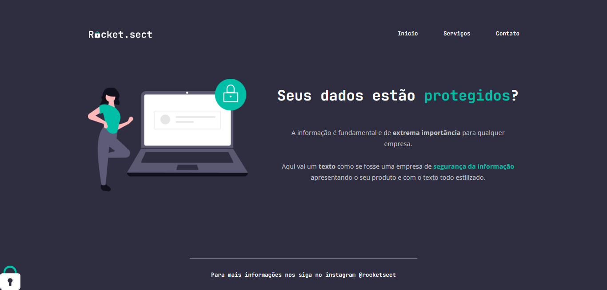

<h1 align="center"> Recriando Layout 02-02 - Landing Page </h1>

2º Projeto de landing page criado durante o curso Explorer de Rocketseat.

  

## 🚀 Tecnologias

Esse projeto foi desenvolvido com as seguintes tecnologias:

- HTML 
- CSS
- Figma

## 💻 Projeto

O objetivo do projeto foi a criação de uma landing page que tem como tema uma empresa de segurança de dados.

## 🔖 Layout

Você pode visualizar o layout do projeto através [DESSE LINK](https://www.figma.com/file/XBR1DetHgzkYvDUlRQmPW7/Explorer-(Copy)?type=design&node-id=0-1&t=Q0GzTi5PmbeFK2Mt-0). É necessário ter conta no [Figma](https://figma.com) para acessá-lo.

## :memo: Licença

Esse projeto está sob a licença MIT.